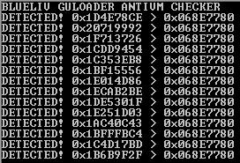

# GuLoader AntiVM Detection Tool

The tool has been created from the code of the GuLoader sample sha256 25018a8ff2a535ed05ebe8a1d2158a79dbeb53fc0be67d4e788bc936cb551b6d without modifications, to avoid modifying its behavior. 

If the sandbox is detected, it displays by console the EDI value after the 0x186A0 loop have been completed. 

However, if the sandbox is not detected, a message appears on the screen indicating that it does not detect the sandbox. 

If the tool does not display any value, there are two possibilities: 

- The result of the operation between the RDTSCs is less than or equal to 0. 

- The result returned by the _RDTSC_OPS function is less than 0x32. 

In both cases the execution would stay in an infinite loop. It is recommended to analyze the application step by step to find the problem. 

We have conducted some tests using the article’s sample in several well-known public sandboxes and have found that the sample does not run correctly in most of them. 

In those that allow access to the API log it is possible to see that the last logged API calls are: 

- NtCreateFile of C:\Program Files\Qemu-ga\qemu-ga.exe 
- NtCreateFile of C:\Program Files\qga\qga.exe 

This is because the RDTSC and anti-hook checks are performed after those calls, and may be avoiding the correct execution of the sample. 

We hope our tool can help to fix those problems.

Link to article:

